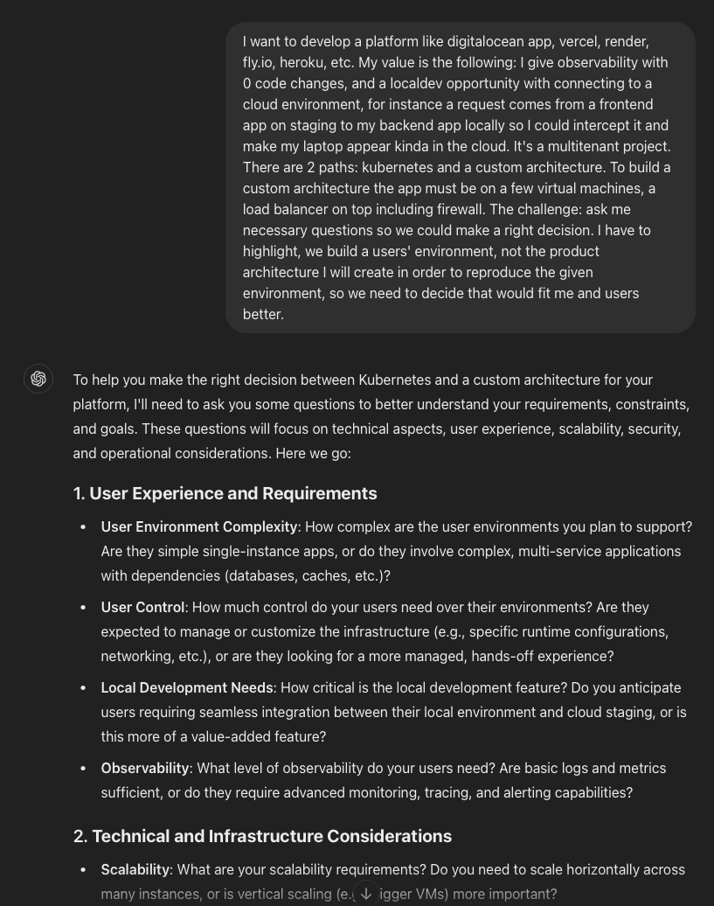
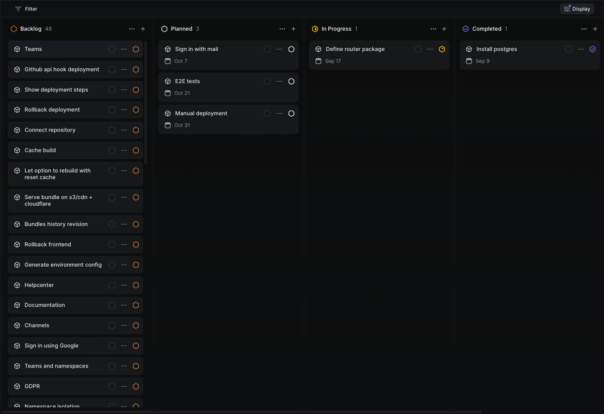

## Devlog #0: logging, linter, Zitadel, codegen, e2e tests

Today I want to share with your my first steps of creating new project.
For a long time I've wanted created something cool, really meaninful, and after all I step into my idea: Platform as a service.

<!--truncate-->

The main tech stack has beeen defined: Go for a main backend, perhaps JavaScript for cdk integration.
All the infra will be used from a well known cloud providers (not aws ofc, no clue who can understand how to user it).
First iteration will not such words as a frontend, ui, design. Ofc I want to make it, but only future history can judge me.

### The problem

The technical problem exists, it's fun to figure out.
But no the main one. The biggest fight Im gonna accept is __procrastination__. Im such a person who pushes further all the tasks very often. I just have little to do with time discipline. That's what will stop me from the progress.
So the easiest way to move progress away - do whatever, but not the progress.

### The planing

So I decided to plan everything and understand how big the actual project is gonna be.
So I start speaking with GPT in order to express my mind, kinda talking to a duck. 
Instead of asking what I should do I explained my plan and asked to ask __more questions__ so it could help me to clarify the technical solution and the plan.



<details>
<summary>
Here you can find a prompt I used
</summary>
I want to develop a platform like digitalocean app, vercel, render, fly.io, heroku, etc. My value is the following: I give observability with 0 code changes, and a localdev opportunity with connecting to a cloud environment, for instance a request comes from a frontend app on staging to my backend app locally so I could intercept it and make my laptop appear kinda in the cloud. It's a multitenant project. There are 2 paths: kubernetes and a custom architecture. To build a custom architecture the app must be on a few virtual machines, a load balancer on top including firewall. The challenge: ask me necessary questions so we could make a right decision. I have to highlight, we build a users' environment, not the product architecture I will create in order to reproduce the given environment, so we need to decide that would fit me and users better.
</details>

Initially I thought I will do it providing a user set of virtual machines connected under VPC, putting a load balancer on top, back to 2000. I thought it will make it cheaper and some tools just easier to implement.

Chatting to GPT I realized - Kubernetes will provide it a way quicker, most of the stuff is just ready to go like network policies, load balancing, SSL, deployment/rollback, health monitoring, resources observability, Istio adoption. Istio is very useful for observability and local first development, it became a new word today - __remocal__.

When stepped into the planning I decided to make it even longer.
I wanted to researched all the kanban boards, unresistable.
I used to use Trello and it was ok, but using api in power-ups boundaries sucks. Not really somethign I need right now though. 

I tried Cluckup, it's a laggish joke, even worse than Jira to make you feel you are already enterprise.
I tried Asana and saw 0 difference with Trello, I spent about 2 minutes to confirm it and exist.

### The ugly thing

In the end I found Linear. 
To be fair it looked ugly, the design is equal to supabase: fonts, buttons.

A few minutes later I started catching.
Keyboard first design - that's what I buy.

So I read Linear Method, the framework they apply internally. It was hard to accept it, I think older I get more conservatibe I become, but I dig it anyway.
The basic element is an issue. It might have sub-issues. And they might have.
They can be collected in a project.

There are bunch of other staff I don't use, but I will share it below.
- __Cycle__ - like a sprint, hate it.
- __Triage__ - inbox, it's a boss feature in my opinion, you can aggregate communication channels in a single place, then an on-call person can carry them, create issues or remove.
- __Initiative__ - collection of the projects, they can be presented as a time line or a strategy decision, or even a roadmap on a timeline. 

As a result I cooked quite a few cards (48 projects in a backlog 😱️️️️️️).



## Infra preparation

### Logging and recovery
I implemented a simple logging solution combined with a recovery middleware. 
I find logging panic behaviors essential, and instead of separating these middlewares, I combined them for simplicity.

There are several ways to handle logging in Go applications:
- Inject a logger into every struct
- Define a global (singleton) logger
- Inject a logger into `context.Context`

__I prefer the last approach__ because it offers the flexibility to:
- Add request IDs to log messages, useful when logging in the data layer
- Attach additional data fields to the logger for use in middleware, e.g. computed properties in a business layer

The implementation is straightforward, and you can find the code [here](https://github.com/treenq/treenq/blob/21dd255da33b7255ac1338edf75b36d048a6b2b7/pkg/vel/log/log.go#L72)

A couple of _caveats_ I encountered:
1. There’s a timestamp formatting issue in the slog package. It sometimes fails to format correctly, so I added a simple fix:
```go
if a.Value.Kind() == slog.KindTime {
  t := a.Value.Time()
  a.Value = slog.StringValue(t.Format(time.RFC3339))
}
```
2. I wanted to adjust the log level based on the HTTP response status: log warnings for client errors (4xx) and errors for server errors (5xx):
```go
logFunc := logger.DebugContext
if resp.status >= 500 {
  logFunc = logger.ErrorContext
```

3. Finally, I added panic recovery and logged the error:
```go
defer func() {
  if recovered := recover(); recovered != nil {
    logger.ErrorContext(
      r.Context(), "recovered from panic",
      ...
      "recovered", recovered,
      "stack", string(debug.Stack()),
    )
    resp.WriteHeader(http.StatusInternalServerError)
    if _, err := resp.Write([]byte("internal server error")); err != nil {
      logger.ErrorContext(r.Context(), "failed to write response", "error", err)
    }
  }
}()
```

It’s crucial to override the HTTP status during recovery, which is why I had to implement my own response writer.

### Linter
I kept my linter setup as simple as possible. 
I don’t use a complex configuration—just a single command added to the Makefile:
```go
go install github.com/golangci/golangci-lint/cmd/golangci-lint@v1.59.1
```

### AuthZ

My goal was to define the simplest authentication solution, one that could be extended later to support role-based access control (RBAC).

I considered a few options, including __Ory__ and __Keycloak__, but both felt like overkill for my needs—too complex and cumbersome. 
I wanted something:
- Easy to configure
- A single binary to allow self-hosting
- With a simple, clear open-source license (like Apache 2.0)
- Dependent only on PostgreSQL

I initially looked at __Logto__, a fresh new solution that seemed simple and clean. 
However, it felt geared more toward frontend developers rather than backend engineers, and lacked some of the features I needed.

That’s when I found __Zitadel__. 
Created by some of the folks behind Ory, __Zitadel__ has strong security foundations. 
Since I’m building only a backend API, I focused on authZ, using token introspection (i.e., validation), rather than issuing tokens.

It was straightforward to create a service account token for my e2e tests to check the authorization middleware.

I also verified that configuring RBAC and identity brokering with providers like Google and GitHub wouldn’t be an issue (i.e., “Sign in with Google”).

###  Generate api client

As I explain in my API design [page](https://dennypenta.github.io/mynameis/blog/api-design) one of the benefits I want to achieve is easy API client generation for multiple languages. 
The first language, naturally, is Go, as I need it for my e2e tests. 
Since the implementation will change frequently, I’m skipping unit tests for now and focusing on e2e tests to ensure the app’s overall stability.

The client generation involves:
- Collecting [API definition](https://github.com/treenq/treenq/blob/21dd255da33b7255ac1338edf75b36d048a6b2b7/pkg/vel/router.go#L124) from the router (models, routes)
- [Building](https://github.com/treenq/treenq/blob/21dd255da33b7255ac1338edf75b36d048a6b2b7/pkg/vel/gen/client.go#L35) the data from the definitions to use in the client generation.
- Feeding that data into a [template](https://github.com/treenq/treenq/blob/21dd255da33b7255ac1338edf75b36d048a6b2b7/pkg/vel/gen/templates/client.tpl#L1)

The result is a generated Go [client](https://github.com/treenq/treenq/blob/21dd255da33b7255ac1338edf75b36d048a6b2b7/client/client.go#L11). I can easily add other templates later, such as for TypeScript, and use them in my tests.

### Defining e2e tests

With the generated client, I can now define the simplest setup for my e2e tests.

First, I created a Docker image and a Docker Compose setup. 
These are similar to a regular production environment but with a few additional tricks.

My [Dockerfile](https://github.com/treenq/treenq/blob/21dd255da33b7255ac1338edf75b36d048a6b2b7/Dockerfile#L15) includes an extra [target](https://docs.docker.com/build/building/multi-stage/#stop-at-a-specific-build-stage) to run a debugger in the tests:
```js
FROM builder AS dev

# Install Delve (debugger)
RUN --mount=type=cache,target=/go/pkg/mod/ --mount=type=cache,target="/root/.cache/go-build" go install github.com/go-delve/delve/cmd/dlv@v1.23.0

RUN --mount=type=cache,target=/go/pkg/mod/ --mount=type=cache,target="/root/.cache/go-build" go build -gcflags=all="-N -l" -o server ./cmd/server

CMD ["dlv", "--listen=:40000", "--continue", "--headless=true", "--api-version=2", "--accept-multiclient", "exec", "server"]
```

Next, I updated my [Docker Compose](https://github.com/treenq/treenq/blob/21dd255da33b7255ac1338edf75b36d048a6b2b7/docker-compose.e2e.yaml#L19) file to expose the debugger port and allow clients to attach:
```yaml
server:
  build:
    context: .
    dockerfile: Dockerfile
    target: dev
  ports:
    - '8000:8000'
    - '40000:40000'
  security_opt:
    - seccomp:unconfined
  cap_add:
    - SYS_PTRACE
  env_file:
    e2e.env
  depends_on:
    postgrese2e:
      condition: service_healthy
  restart: always
```

I also created a dedicated PostgreSQL instance for e2e tests to keep it separate from my local development environment:
```yaml
  postgrese2e:
    image: postgres:16.3
    restart: always
    environment:
      POSTGRES_HOST_AUTH_METHOD: 'trust'
      POSTGRES_DB: tq
    ports:
      - "5432:5432"
    tmpfs:
      - /var/lib/postgresql/data
    healthcheck:
      test: ["CMD-SHELL", "pg_isready -U postgres -d tq"]
      interval: 3s
      timeout: 3s
      retries: 10
```


Finally, I defined a simple Makefile command to run the tests:
```js
start-e2e-test-env:
	docker-compose -f docker-compose.e2e.yaml up -d --build
	@echo "Checking e2e test environment is running..."
	until $$(curl --output /dev/null --silent --fail http://localhost:8000/healthz); do printf '.'; sleep 1; done && echo "Service Ready!"
	echo 'Service has been started'
```

The `curl` loop waits for the service to be ready since the app depends on the database connection, and migrations need to be applied. 
This kind of delay is common — you can imagine even more delays due to cache warming, downstream API fetching, etc.

#### Bye

Thank you for reading, come here and see what's gonna be in the end.

Repository is here: http://github.com/treenq/treenq
