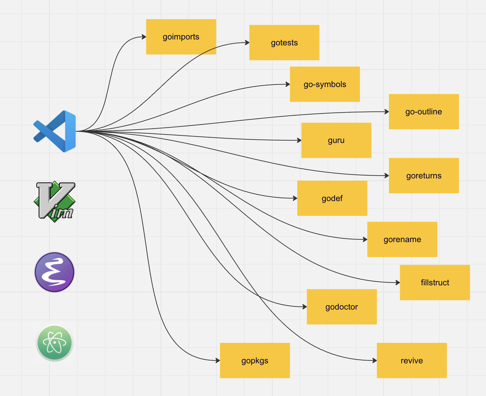
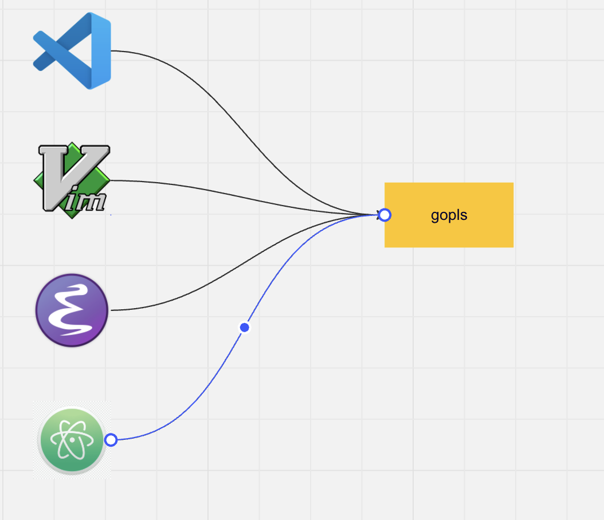

A few years ago we had 2 editors for Go: jetbrains plugin to IntelijIdea and YOUR_NAME_IT with a go plugin.
First brought tons of closed source components that eventually became Goland and bunch of open source components used by another editor Go plugin:

It worked for a while, but it has a lot of issues.

1. Number one, you install a plugin, it installs a tenish of the others, every version half of the tools are broken and that's very lame dance happened every release.
2. The integration complexity, every editor did its own integration set, some used only part of them, some integrated them one by one.
3. Performance, it's not obvious today, but every tool worked once per editor request, it means every click "Go to definition" it has index the code base, find the implementatons or the object locations navigate you.

<!--truncate-->



### LSP

And Microsoft did a next step in creating IDE.
They decided it's important to decouple Javascript language support from the the editor.
So they created another component for autocompletion, code navigation, refactoring and diagnostic.
This component must run outside of editor in order to let many vscode instances to reuse the same indexing and cache.
The called it a language server and it made a new standard: LSP, Lanugage Server Protocol.

[microsoft.github.io/language-server-protocol](https://microsoft.github.io/language-server-protocol/specifications/lsp/3.17/specification/)



It gives every language team to make a developer experience an editor independant delegating all the main editor capabilities to the LSP implementation.

It changes 3 fundamental things in the software history:

- Language team supports any LSP compatible editor, it gives more editors come to the market like Helix, Zed, NVIM, etc.
- We finally don't need to install a bunch of binaries to make the development experience just "fine"
- And a bonus point, it gives a Go team to focus on supporting more complicated use cases like large repos support increasing performance for everyone, so it means everyone can make a dev experience better for everyone.

### LSP Protocol

Let's have a look at the protocol breifly.
It has a client that drives all the necessary capabilities implemented on button clicks, hover, hotkeys, etc.
Implementing an LSP client it calls a server to resolve some actions.
For instance clicking Go to definition it sends a request with a given editor position where the interface method is described.

```json
{
  ...
  "method": "textDocument/definition",
  "textDocument": {"uri": "file://location/file.go"},
  "position": {"line": 42, "character: 3"},
  ...
}
```

And the server contains all the indexed codebase can return a list of locations so editor suggest them to a developer.

### gopls under the hood

Globally gopls has Cache.
Opening an editor it creates a new Session to connect to the server.
Opening a new project in the editor it creates a new Workspace looking for a module, go.work or GOPATH directory.
It holds metadata to let gopls know where you actually want to navigate in the code.
It uses default build, it also means it ignores build flags if you use them.

:::info
In case you wish to see better dev exprience:

- changes to one module to be reflected in another
- optimize memory usage by reducing the number of builds it must track
- give gopls information where do you work
  then use go.work.

  :::

### Capabilities

All the features list you can find [here](https://github.com/golang/tools/blob/master/gopls/doc/features/README.md).
Below I shortly describe what you could find useful to perform gopls at 100%.

- General information and a doc string on hovering
- Diagnostics: static analysys, compile errors
- Completion: how vscode intellisense gives you suggestion or cmp/blink for nvim.
- Navigation: Go to definition, List references, List implementations, etc.
- Transformation: format, sort imports, and refactoring as rename, inline, extract, etc.


### What about Goland

Goland is the opposite, it provides its capabilities as a closed source software. Lately it supports LSP as well, but they rarely can be compared in the feature set.

The main difference we all together can make gopls better, while we never can contribute to Goland.

If you found an idea like "I miss this hostkey to make this thing" or "generate that piece" or "discover that place" you probably want to develop another editor plugin.
It happened it me either, but apparently it's not the best solution.
If it's purely related to a language you just need to contribute to gopls.

### How to debug gopls

Here I describe a practical guide to gopls contribution.
I skip the issue discussion with your proposal, expected output, how you attach a visual picture and communicate nicely, gerrit user experience so on.

All the examples are using vscode, I'm sure vim/emacs nerds have cracked it.
We don't use GoLand here because it has a lot of internal tooling for Go that may add misunderstanding whether it's gopls or GoLand magic.

First, let's configure a local debugging setup.
Inside the repo we add a debugging statement for vscode in order to run our forked version of gopls, in a folder `tools/gopls/` we add:

```json
{
  "version": "0.2.0",
  "configurations": [
    {
      "name": "Run Gopls",
      "type": "go",
      "request": "launch",
      "mode": "auto",
      "program": "./main.go",
      "args": ["-port=9000"]
    }
  ]
}
```

Now you can run your gopls.

In another editor instance you add a workspace setting:

```json
"go.languageServerFlags": [
  "-remote=localhost:9000"
]
```

So you know how to make a call from your editor to the server and found a place to debug.

For example you want to add a quickfix, it's a Code Action to make a Transformation, like implementing an interface or generating a function, etc.

Now guess where to put a breakpoint and call a Code Action from a client, in vscode you need to push `CMD + .` or find your hotkey in the [doc](https://code.visualstudio.com/docs/editor/refactoring#_code-actions-quick-fixes-and-refactorings).

### A few nice words in the end

What's really important Go team uses LSP compatible editors, so real dog fooding comes in the room, they experience what the build and introduce the features they miss.
I know for sure Alan Donovan uses Emacs, at least he said so.

If you are still interested look his [speach](https://youtu.be/8EsaJC9cn4w) how they optimized Gopls last interation.

A really hope it raises awareness across the entire Go community and lights the interest to the tooling, more people contribute better experience everyone would have.
