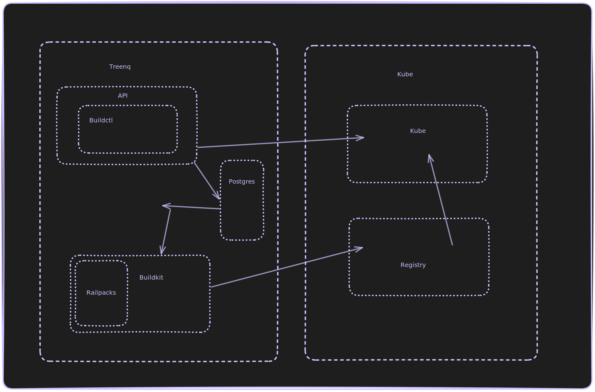

## Build a container inside a rootless conatiner 

A PaaS has a very dev friendly use case: when a user just conneects a repository we must build the image from a Dockerfile in the repo. 
We assume at the beginning a team doesn't have a CI pipeline and wants to share a quick demo to the customers.
There are many ways to do it. Let's look at all of them and at the design we chosed for [Treenq](https://github.com/treenq/treenq)

<!--truncate-->

### Grug: docker in docker 

As a straight forward approach we can forward docker host to a container and build it.
It has quite a lot of problems:
- dind requirees running in privileged mode: it opens a rabbit hole to a host machine
- moreover, it doesn't seem an option to make it rootless 
- docker daemon is running, it's not free for resources 

Even to get started the user case it didn't seem convinient, it requires configuration to make it possible, so I decided to move to more secure options.

### Kaniko: k8s native builder 

Kaniko is created to solve this problem. 
It allows setting up an environemnt for a cluster where the workload is built near it's runners, perhaps on different nodes in order to avoid any resource fight.
The idea is it spans a new container that builds an image, the container feels great in unprivileged environment and doesn't require a docker daemon.

Technically it doesn't create a new namespace, instead it unpacks an image layer and does chroot. 

You can even span your registry right in this cluster, like a regular one or [Harbor](https://github.com/goharbor/harbor) and the builds flow is completely isolated from the planet.
It like like __kaniko -> registry -> k8s workload node__.

In terms of security Kaniko is the winner. 
It does require root to run, but the abstraction is well done to keep it away. 

Looks fancy, but has a couple restrictions:
- it buidls containers only inside a Kubernetes cluster, it works in k8s, k3s (which we use for e2e tests) and perhaps some more.
- it has no more capabilities, if I need to inspect an image. 
- it's not able to build windows images 
- build time performance is slightly lower 

For instance, I want to rollback, I want it real quick, so before launching a build job I want to look if the image is in the registry.
For that purpose I must use skopeo or another tool to talk to a registry.
Not really a big deal.
Perhaps, one day Treenq will need [Skopeo](https://github.com/containers/skopeo).

Looking back it looks a good option and most likely I would say it's worth trying it. 
But I thought it's very important to have a capability to run builds outside of a cluster, may be even on a isoalted VM, which is not really smart requirement I guess.
Also, the complexity to set it up didn't look easy enough, I have to span a k8s resource, make a ServiceAccount for it and many more to start building + adding inspection API near by.

On top of that, recently, Kaniko stepped down right into arhive.

### Buildah: isolated package

[Podman](https://github.com/containers/podman), a Docker alternative, has a way cleaner opensource relation and how they structure the packages and repositories.
Podman has a designated module, [Buildah](https://github.com/containers/buildah), which is used exactly for building images.
It requires no priovileges, root, daemon, nothing (technically speaking, but there is a price for it).

It doesn't require a daemon to run.
Package is written in Go, therefore I can embed it right into the service instead of adding a syscall.

DISCLAIMER: I understand I use undocumented API of the package and it can hurt it. If it happens I can freeze the version, and then either the project fulfills the graveyard or it migrates to buildkit.

First step is to understand how to run buidlah in a container. 
There is an official [image](https://hub.docker.com/r/buildah/buildah) based on Fedora, but I want my app run at least in Ubuntu.
Better in alpine/scratch ofc, but it doesn't seem viable.

There are a some guides on [how to run buildah in a container](https://developers.redhat.com/blog/2019/08/14/best-practices-for-running-buildah-in-a-container) and [in privileged environment](https://opensource.com/article/19/3/tips-tricks-rootless-buildah), so I can slowly transform this information to prepare Ubuntu image.
Here is what I got [eventually](https://github.com/treenq/treenq/blob/main/Dockerfile).

Ok, we can build, next step I want to build a small image from Go application.

There is a [guilde](https://github.com/containers/buildah/blob/main/docs/tutorials/04-include-in-your-build-tool.md) showing how programmatically execute dockerfile steps (run, copy, etc.), but it's not what we need.
We simply need to run `buildah build`.

At this point I have to dig the source code to understand what's happening.
Jumping right inside the build command in the source code we find there is a storage resource is required to start and we can execute the build 
```go
	buildStoreOptions, _ := storage.DefaultStoreOptions()
	buildStore, _ := storage.GetStore(buildStoreOptions)
```

And next step we can start build:
```go 
	id, _, err := imagebuildah.BuildDockerfiles(ctx, buildStore, define.BuildOptions{
		ContextDirectory: args.Path,
		Registry:         a.registry,
		Output:           args.Name,
		Out:              out,
		Err:              errOut,
		ReportWriter:     reportOut,
		IgnoreFile:     dockerignorePath,
		AdditionalTags: []string{image.FullPath()},
	}, args.Dockerfile)
```

To push the image we need to get a reference to this image in our store and prepare system context: registry authentication, tls flags, certs.
```go 
	storeRef, _ := alltransports.ParseImageName("docker://" + image.FullPath())
	systemContext, := &types.SystemContext{
		DockerCertPath:              a.registryCertDir,
		DockerInsecureSkipTLSVerify: types.NewOptionalBool(!a.registryTLSVerify),
		DockerAuthConfig:            &types.DockerAuthConfig{
			IdentityToken: a.registryToken,
		},
	} 
	_, _, err = buildah.Push(ctx, id, storeRef, buildah.PushOptions{
		Store:         a.store,
		SystemContext: systemContext,
	})
```

Full version of this module is [here](https://github.com/treenq/treenq/blob/main/src/repo/artifacts/docker.go).

One important detail: first lines of your main function must be:
```go
	if buildah.InitReexec() {
		return
	}
	unshare.MaybeReexecUsingUserNamespace(false)
```

It matters to act Buildah as root without being real rool. 
It locks the OS thread, prepares uid/gid mapping and reexec as a new user in a new namespace. 
So, softly speaking, it's not ideal to run this code inside the application code.

The best design would be to have the application code isolated from pool of builders. Builders can receive the build tasks and still execute it inside a Go app in order to being able to extend he capabilities.
This design allows me to extend options to build images: In a similar manner I can embed buildpacks to build simpler apps without a Dockerfile.

Buildah, unfortunately, also has a few caveats and it's a little behined of docker.
- For instance buildah can't inject variables/secrets [on RUN command](https://github.com/containers/buildah/issues/5892) while docker can.
- Or it can't detect [variables in images](https://github.com/containers/buildah/issues/5408)
- Also, runniong it unprivileged is quite tricky and it requires specific arguments for container and specific build of the image itself. 
The domain is huge to learn, different backends, storages drivers and so on.

From this [issue](https://github.com/containers/buildah/issues/2554) I learned vfs storage driver copies the entire sublayer on every layer.
So it's better to use overlayfs, it requires /dev/fuse to run in non privileged container.

As a bonus, it might be cool to put it inside alpine, but not sure it's viable at all. 
Putting a cgo app itself requires some [dance](https://baicai.xlog.app/docker_golang_alpine_cgo_build?locale=en) for it.

### BuildKit: overlooked option

What if docker could get rid of priviileged mode? 

Buildx (BuildKit) is a module of docker (or moby?) that's responsible specifically for building iamges.

BuildKit still has a daemon and it requires a privileged mode either.

However, we can run fake root using [RootlessKit](https://github.com/rootless-containers/rootlesskit/).
We can build our flow in the following way:
- run a daemon 
- run buildctl to start build 
- when we are done we close the daemon 

RootlessKit requires turning off apparmor and seccomp, because the default profile doesn't allow spawning new namespaces.
Also, add a few linux capabilities like SETUID, SETGUID and fake root users removing the option no-new-privileges.

It seems quite secure, but has a few constraints:
- requires support explicit uid and gid which is not fine and might be annoyign 
- requires supporting a designated pool of build machines, which is actually makes sence in terms of designing a PaaS, but makes it a way complicated to start


In case of buildah it required me to run the build in the same application.
In order to scale it well I have to build network transport and mount volumes between them, which makes it quite complicated to setup.

Buildkit provides its capabilities out of the box. It makes its API a bit  harder to learn, since it's not documented well and perhaps not supposed to be used like that.

Buildkit brings to main modules to the table:
- buildkitd - a daemon to serve the builds, it may expose a unix socker to tcp connection
- buildctl - the actual buildkit client

Now it requires to to setup additional container buildkitd and write a client part inside my Go service.
As a benefit I get rid of building images and buildkit dependencies.

```yaml
  buildkit:
    image: moby/buildkit:v0.23.0
    privileged: true
    container_name: buildkit
    ports:
      - "1234:1234"
    volumes:
      - ./buildkit/entrypoint.sh:/entrypoint.sh
      - ./buildkit/buildkitd.toml:/etc/buildkit/buildkitd.toml
      - ./registry/certs:/certs
      - ./buildkit/certs:/buildkit
    entrypoint: ["/entrypoint.sh"]
    healthcheck:
      test: ["CMD-SHELL", "buildctl --addr tcp://localhost:1234 debug workers"]
      interval: 5s
      timeout: 30s
      retries: 3
    extra_hosts:
      - "localhost:host-gateway"
```

entrypoint specifies the arguments to run, it overrides the default address to tcp. 
buildkitd mostly contains registry and service access and its TLS to test and support self signed certs flow. 
Buildkit not only builds images, but also pushes them, therefore it requires access to the registry. Since my service has acces to the local registry as to localhost I want my buildkit access it on localhost too, therefore I define extra_hosts there.
Without the extra_hosts config registry will be available on registry host as define in the rest of the docker-compose.yaml.

Full example is here: https://github.com/treenq/treenq/blob/main/src/repo/artifacts/docker.go

docker-compose is in the root of the repo.

Final design of the platform is the following:


Happy to answer your questions below in the comments
